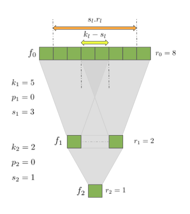

# CNN Receptive Field

Extract the receptive field of a fully connected cnn.

```gitignore
python receptive_field_size.py --kernel_sizes 5 2 --strides 3 1
```

Output:
```gitignore
[INFO] receptive field for a network with kernel-sizes: [5, 2] & strides: [3, 1] is: 8
```



**Note:** image is taken from: https://www.baeldung.com/cs/cnn-receptive-field-size

# references
1) https://www.baeldung.com/cs/cnn-receptive-field-size
2) https://distill.pub/2019/computing-receptive-fields/#return-from-solving-receptive-field-size